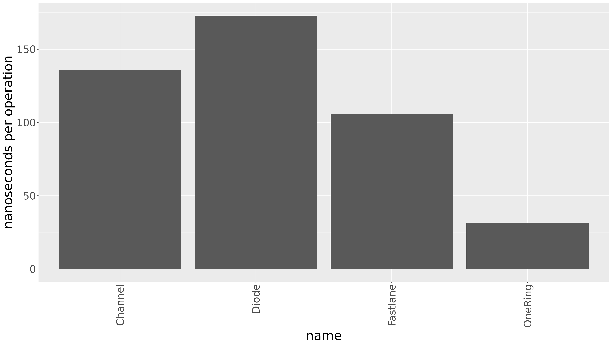

# Introduction
This directory includes queue implementation benchmarks for various different configurations of producer and consumer counts. Each data structure may have different safety and ordering guarantees. This document should include results along with safety and ordering information to inform the viewers of the tradeoffs.

# Guarantees
Different queue-like data structures sometimes make tradeoffs for performance so we can't treat all of these libraries as equals. What they do is give you a basic FIFO interface but what they guarantee in safety and ordering can differ. This section documents the guarantees each provide so you can decide what is best for you.

### Data loss
Below is a description of data loss behaviours queues can experience that may be important for your use case to understand.

**_D1_**. Producers outpace consumers and overwrite unread records.  
Often seen in ring buffer implementations if a producer hits the end of the buffer it loops back to the front and keeps writing. If the producer is outpacing the consumer it means the producer could eventually lap the consumer and overwrite records causing data loss.

**_D2_**. Producers outpace consumers and consumers skip records to keep up.  
If the consumer isn't keeping up with the producer some implementations may skip records to keep up.

```
Library             Order preserving    Data loss   Producers    Consumers
--------------------------------------------------------------------------------
Channels            Yes                  No         1+           1+
Diodes              Yes                  D1         1+           1+
Fastlane            Yes                  No         1            1
```

# Setup
```
Ubuntu Linux
Intel(R) Xeon(R) CPU E5-2670 v2 @ 2.50GHz x 20 Cores (40 Hyperthreaded)
L1 Cache:   320 kB
L2 Cache:  2560 kB
L3 Cache: 25600 kB
Memory: 126 GB
```

# Results
[](https://github.com/kellabyte/go-benchmarks/raw/master/results/queues.png)

### p90
[](https://github.com/kellabyte/go-benchmarks/raw/master/results/queues_hdrhistogram_p90.png)
### p99
[](https://github.com/kellabyte/go-benchmarks/raw/master/results/queues_hdrhistogram_p99.png)
### p999
[](https://github.com/kellabyte/go-benchmarks/raw/master/results/queues_hdrhistogram_p999.png)
### p9999
[](https://github.com/kellabyte/go-benchmarks/raw/master/results/queues_hdrhistogram_p9999.png)
### p99999
[](https://github.com/kellabyte/go-benchmarks/raw/master/results/queues_hdrhistogram_p99999.png)
### p999999
[](https://github.com/kellabyte/go-benchmarks/raw/master/results/queues_hdrhistogram_p99999.png)
### p9999999
[](https://github.com/kellabyte/go-benchmarks/raw/master/results/queues_hdrhistogram_p999999.png)

```
make queues

goos: linux
goarch: amd64
pkg: github.com/kellabyte/go-benchmarks/queues
Benchmark1Producer1ConsumerChannel-40     	 5000000	       223 ns/op	   4.48 MB/s	       0 B/op	       0 allocs/op
Benchmark1Producer1ConsumerDiode-40       	10000000	       211 ns/op	   4.73 MB/s	      15 B/op	       0 allocs/op
Benchmark1Producer1ConsumerFastlane-40    	10000000	       175 ns/op	   5.69 MB/s	      16 B/op	       1 allocs/op
Benchmark1Producer1ConsumerOneRing-40     	20000000	       106 ns/op	   9.39 MB/s	       0 B/op	       0 allocs/op
Benchmark1Producer1ConsumerOneRing2-40    	20000000	        83.8 ns/op	  11.93 MB/s	       0 B/op	       0 allocs/op
PASS
ok  	github.com/kellabyte/go-benchmarks/queues	13.473s
```